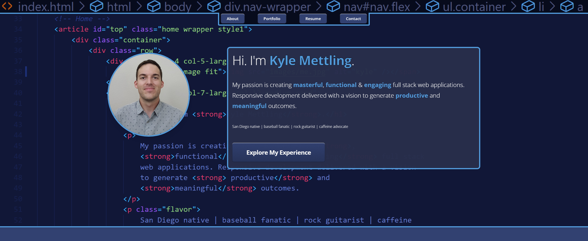

# Kyle Mettling
## Software Engineer

<!-- [Live](https://baseball-pitch-guesser.herokuapp.com/) on Heroku -->

   

## How It's Made:

**Tech used:** HTML, CSS, JavaScript

## Optimizations

## Lessons Learned:

## TODOs:

## Keep Exploring:

Take a look at these other examples that I have in my portfolio:

**Baseball Pitch Guesser:** https://github.com/kylemettling/BaseballPitchGuesser

**Weather App (React):** https://github.com/kylemettling/weather-app

**"NunGram":** https://github.com/kylemettling/theNunGram

